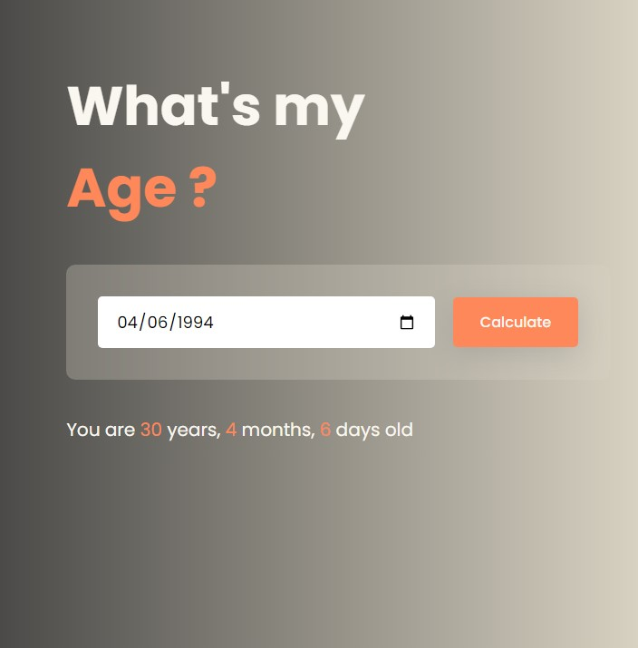

# What's My Age?

**What's My Age?** is a simple application that calculates the user's age based on their date of birth. The app takes a date of birth as input and returns the user's current age in years, months and days.

## Features

- Input date of birth (day, month, year)
- Calculate age in years, months and days
- Simple and intuitive interface

## How It Works

1. The user enters their date of birth (day, month, year).
2. The app calculates the difference between the current date and the entered birthdate.
3. The result is displayed as the user's age in full years.

## Aplicativo em funcionamento

